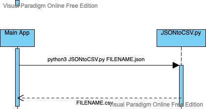

# CS361MicroService
JSON to CSV is a Microservice that takes a JSON file and turns into a CSV file.

# Requests
In order to run the program you must call JSONtoCSV.py with python3 and with an input JSON file commandline argument.
```
python3 JSONtoCSV.py example.json
```
It must be run with python3, contain only one input file, and the input file must be .json.

# Input File Format
The input file must be a JSON file in the format list of objects.
```
example.json
```
```
[
    {
        "Date": "2022-07-27",
        "Shift": "AM",
        "Working": [
            {
                "Name": "Casey Hawkins",
                "id": 5680292337549312
            },
            {
                "Name": "Emma Fuller",
                "id": 5766922566107136
            }
        ]
    },
    {
        "Date": "2022-07-27",
        "Shift": "PM",
        "Working": [
            {
                "Name": "Casey Hawkins",
                "id": 5680292337549312
            }
        ]
    },
    {
        "Date": "2022-07-28",
        "Shift": "AM",
        "Working": [
            {
                "Name": "Emma Fuller",
                "id": 5766922566107136
            }
        ]
    }
]
```

# Receiving
The program will take the input file, create a new CSV file with the same name (excluding .json), under the same file path and input the CSV data into it.
The CSV file will have data in the format: <br />
First row: Data titles <br />
Following rows: Values of each data title for each object <br />
Example output for the above file input.
```
example.csv
```
```
Date,Shift,Working
2022-07-27,AM,"[{'Name': 'Casey Hawkins', 'id': 5680292337549312}, {'Name': 'Emma Fuller', 'id': 5766922566107136}]"
2022-07-27,PM,"[{'Name': 'Casey Hawkins', 'id': 5680292337549312}]"
2022-07-28,AM,"[{'Name': 'Emma Fuller', 'id': 5766922566107136}]"
```

# UML Sequence Diagram


